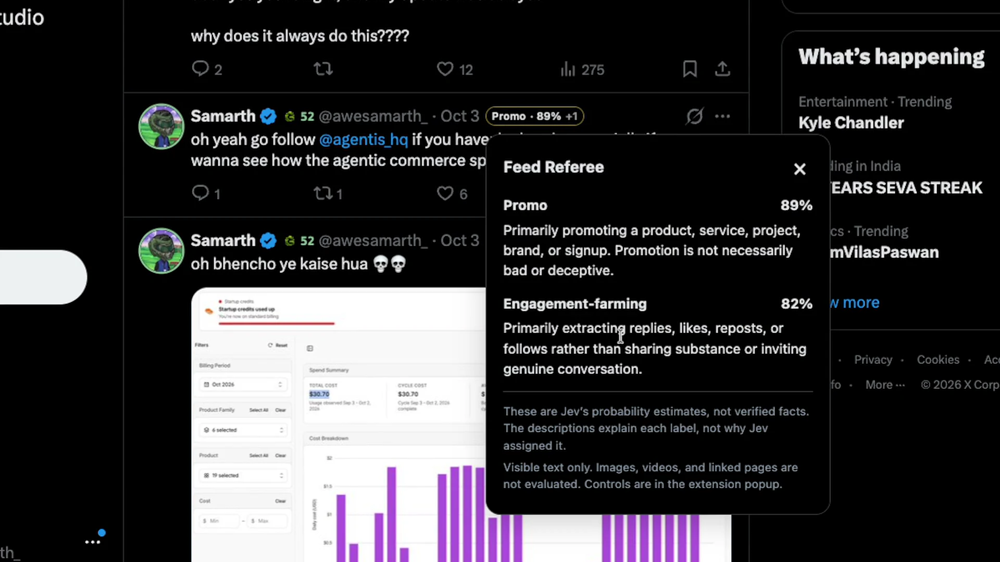

# Jev Experiments

**Six experiments. One model. Programmable common sense.**

An independent project built with [TypeSafe's Jev](https://typesafe.ai/). Games, tools, and a browser extension that put typed judgments and probabilities to work.

[Explore the site](https://jev-experiments.awesamarth.dev) · [Feed Referee](https://jev-experiments.awesamarth.dev/experiments/feed-referee) · [Releases](https://github.com/awesamarth/jev-experiments/releases)

## The experiments

| | Experiment | What it does |
| --- | --- | --- |
| 01 | [Magic Jev Ball](https://jev-experiments.awesamarth.dev/experiments/magic-ball) | A probability-powered fortune teller. Ask, shake, decide. |
| 02 | [Fool Jev](https://jev-experiments.awesamarth.dev/experiments/fool-jev) | Talk your way past a security guard in ten answers or fewer. |
| 03 | [Twitter Account Scorer](https://jev-experiments.awesamarth.dev/experiments/account-scorer) | Score an account's posts and replies, with saved reports and share cards. |
| 04 | [Banger Alert](https://jev-experiments.awesamarth.dev/experiments/flop-detector) | Find out whether your draft looks like a banger, mid, or flop. |
| 05 | [Feed Referee](#feed-referee) | A browser extension that flags ragebait, promo, AI Slop, and engagement farming on X. |
| 06 | [You vs Jev](https://jev-experiments.awesamarth.dev/experiments/you-vs-jev) | Race Jev to categorize twenty customer messages. Accuracy first. |

## Feed Referee

**Less bait. Your call.**

A second opinion for your X feed. Jev adds compact labels beside the author, with independent probabilities for **Ragebait**, **Promo**, **AI Slop**, and **Engagement-farming**. Keep the labels, or choose which posts to collapse. Every collapsed post has a **Show tweet** button.

[](https://jev-experiments.awesamarth.dev/experiments/feed-referee#demo)

[Watch the 38-second demo](https://jev-experiments.awesamarth.dev/experiments/feed-referee#demo) · [Privacy & limits](https://jev-experiments.awesamarth.dev/experiments/feed-referee/privacy) · [Extension source and technical notes](extensions/feed-referee)

### Download and install

Requires **desktop Chrome 120+ or a compatible Chromium browser**, plus **your own TypeSafe API key**. This is a manual, unpacked install, not a Chrome Web Store listing. You do **not** need to run the website, install Bun, or set up a database to use the extension.

1. Open [Releases](https://github.com/awesamarth/jev-experiments/releases) and find a **Feed Referee** release. Under **Assets**, download **`feed-referee-v1.1.0.zip`** (or the newer versioned Feed Referee ZIP), not GitHub's automatically generated “Source code” archives.
2. Extract the ZIP. Move the resulting **`feed-referee`** folder somewhere permanent. Don't delete it after installing.
3. Open **`chrome://extensions`**, enable **Developer mode**, and click **Load unpacked**.
4. Select the extracted **`feed-referee`** folder. It should directly contain **`manifest.json`**.
5. Pin Feed Referee. Open its popup, paste your **own [TypeSafe API key](https://typesafe.ai/)**, read the data-sharing notice, and choose a daily request cap. Settings save automatically.
6. Switch **Referee enabled** on, then open or reload X. The extension starts paused, and collapsing is off by default.

**No release available yet, or prefer the source?** Use GitHub's **Code → Download ZIP**, extract it, and select **`extensions/feed-referee`** at step 4. You can also clone the repository and load that same directory.

**Updating:** Pause the extension, extract the new release, replace the files in the existing unpacked folder, then click **Reload** on its card in `chrome://extensions`. Reload your X tabs. Keeping the same folder avoids creating a second extension installation. A session-only key may need to be entered again. New/replacement keys leave the referee paused until you enable it.

### What to know before switching it on

- **Your key, your API bill.** Requests go directly to TypeSafe, not through this site's backend. New installs default to 2,000 attempts per day; lower this in the popup if needed. Failures and retries count. The daily UTC cap is not a dollar spending limit.
- **Text leaves your browser.** Supported visible post text and quoted context are sent to TypeSafe. This can include protected posts you can view. TypeSafe's terms and privacy policy apply.
- **No DMs or drafts.** Composers, private messaging, account/settings screens, and dialog content are excluded. Images, videos, and linked pages are not analyzed. No auto-likes, replies, or follows.
- **Estimates, not facts.** Labels can be wrong. AI Slop estimates writing style, not proven AI authorship. The demo is edited footage, not an accuracy or inference-speed benchmark.
- **Local controls.** Keys are session-only unless you select Remember key. Device storage is not encrypted or synced. Settings autosave; Off applies immediately. Collapsing is optional and reversible.

For behavior, supported surfaces, storage details, and testing limitations, see the [extension README](extensions/feed-referee/README.md).

## Develop the website

The website uses **Next.js App Router, React, TypeScript, Tailwind CSS, and Bun**. Account Scorer persistence uses **Neon Postgres**. The extension is plain JavaScript/HTML/CSS and has no build step.

```sh
bun install
```

Create an ignored `.env.local` in the repository root:

```dotenv
TYPESAFE_API_KEY=your_server_side_typesafe_key
DATABASE_URL=your_neon_postgres_connection_string
```

The server key powers the web experiments only. It is never bundled with Feed Referee. `DATABASE_URL` is needed for Account Scorer's saved reports, cooldowns, and leaderboard.

```sh
bun run db:migrate
bun run dev -- -p 5555
```

Open [localhost:5555](http://localhost:5555). The landing pages can run without API credentials; the corresponding experiments require their services. Read [AGENTS.md](AGENTS.md) before changing the Next.js app.

```sh
bun run lint
bun run build
```

### Package Feed Referee

```sh
bun run extension:package
```

This creates `dist/feed-referee-v1.1.0.zip` and a matching `.sha256` file. The version comes from the extension manifest. Packaging uses a runtime-file allowlist, excluding keys, `.env` files, tests, browser profiles, recordings, and website assets. It requires the `zip` command. It does **not** commit, push, tag, or publish anything.

Release notes and maintainer publishing instructions: [releases/README.md](releases/README.md).

### Focused extension checks

```sh
bun test tests/feed-referee.test.js tests/feed-referee-dom.test.js tests/feed-referee-worker.test.js
```

The automated checks use fixtures and mocked responses. They are not model-accuracy benchmarks or a substitute for testing on current, real X pages.

## Repository map

```text
app/                       Website pages and server API routes
extensions/feed-referee/   Load-unpacked browser extension
public/feed-referee/       Curated demo video and screenshots for the product page
lib/                       Shared application logic
scripts/                   Database migration, packaging, and development tools
db/                        Account Scorer schema
releases/                  Release notes and publishing instructions
tests/                     Focused Feed Referee regression checks
```

Raw browser snapshots, personal recordings, local browser profiles, and credentials are not included. Only the curated product demo and selected screenshots are website assets.

---

An independent project using TypeSafe's Jev. Not affiliated with X. Probabilities included. Certainty not guaranteed.
